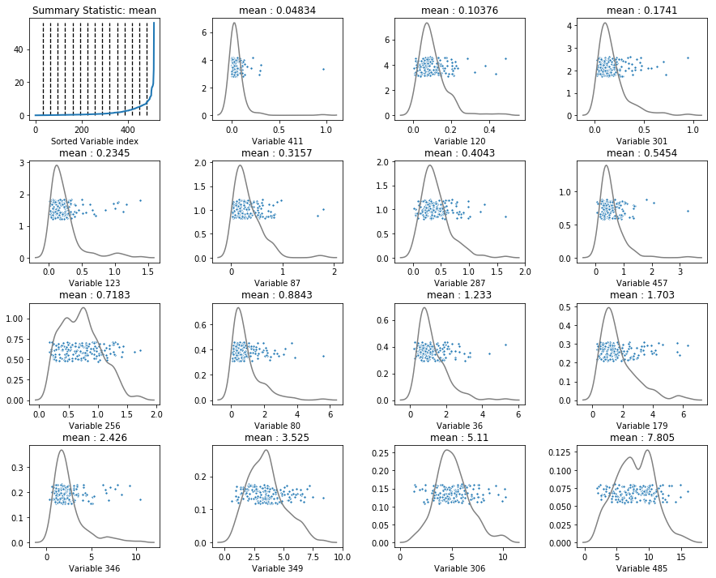

# MarginalDistributionPlot

**author**: Jonghwan Yoo

Marginal Distribution plots is useful exploratory data anaylsis especially when you have many variables which makes it hard to see data visualization. The main idea is to select a representative variables to actually look at their distributions. Selecting representative variables is based on one-dimensional summary statistic of each variable such as mean, standard deviation, etc.  
In summary, marginal distribution plot sort one dimensional statistic(mean, std, skewness, etc.) of all variables and select 15 representative variables(15 minimum, 15 maximum or equally spaced summary statistics) and show their distributions. 

For a detailed discussion of Marginal Distribution Plots see section 4.1 of [Object_Oriented_Data_Analysis](https://marronwebfiles.sites.oasis.unc.edu/Teaching/OODA-STOR881-Fall2019/OODAbookV10tempAug15.pdf).

If you have any question, email here [yjh3620@ad.unc.edu]{yjh3620@ad.unc.edu}.

## Installation

```
git clone https://github.com/HungryJ/MarginalDistributionPlot.git
python setup.py install
```

## Example
mdp function will generate marginal distribution plots.  
Inputs for mdp function are following.  
_mdp(data_object, summary_stat='mean', variable_choice = 'equally_spaced', label = None)_

**data_object** : either 2D numpy array or pandas dataframe.  
Rows have to be variables and columns have to be objects.  

**summary_stat** : Summary statistic to use for representing each variable
Must be either one of ['mean', 'median', 'std', 'skewness', 'kurtosis', 'unique_obs'] or a fuction that takes a vector as input at return a scalar. 

**variable_choice** : How to choose 15 variable to be plotted.
Must be either one of ['equally_spaced', 'min', 'max'] or an length 15 array which is consist of variable indices 

**label** : label of each observation to use for color code

```python
import matplotlib.pyplot as plt
import numpy as np
import pandas as pd
from marginal_dist_plot import mdp

feat = pd.read_pickle('./jive/from_longleaf/y_train_y_activ_feat.pkl')

mdp(feat, summary_stat='mean', variable_choice='equally_spaced')
```




If you have a label for each observation, you can use it for a color code of marginal distribution plots.

```python
mdp(feat, summary_stat='std', variable_choice='min', label = true_label)
```


